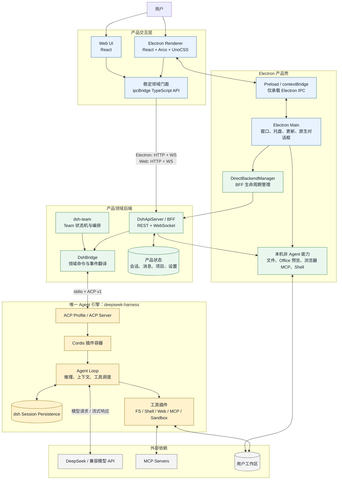
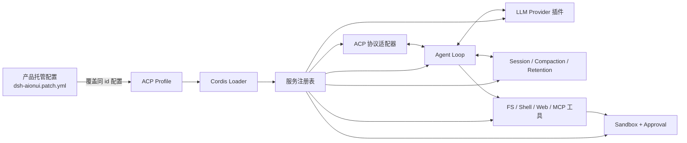
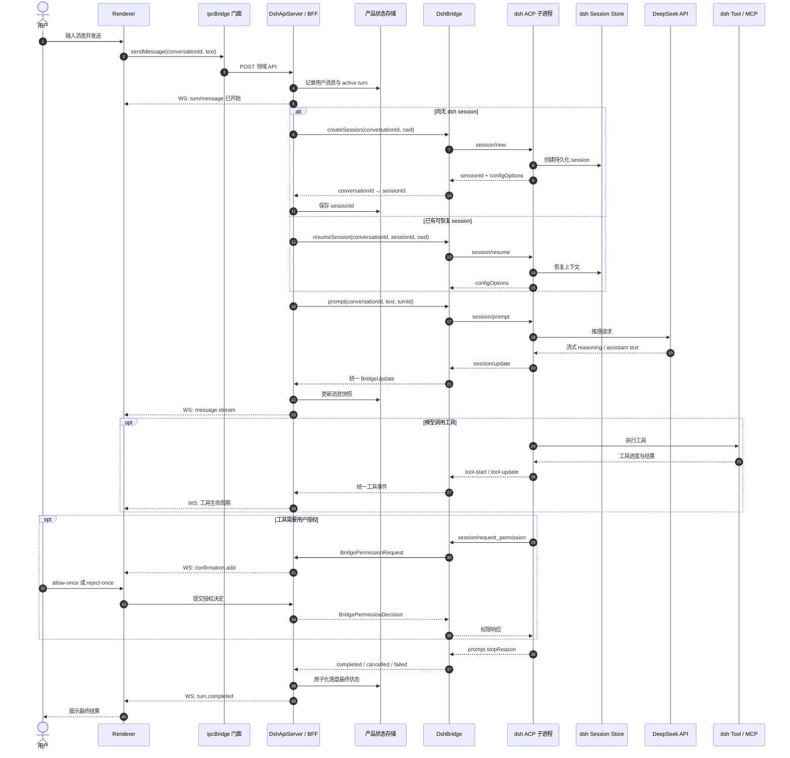
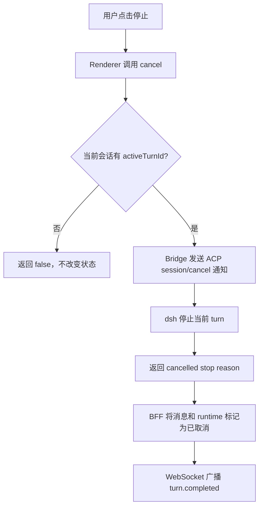
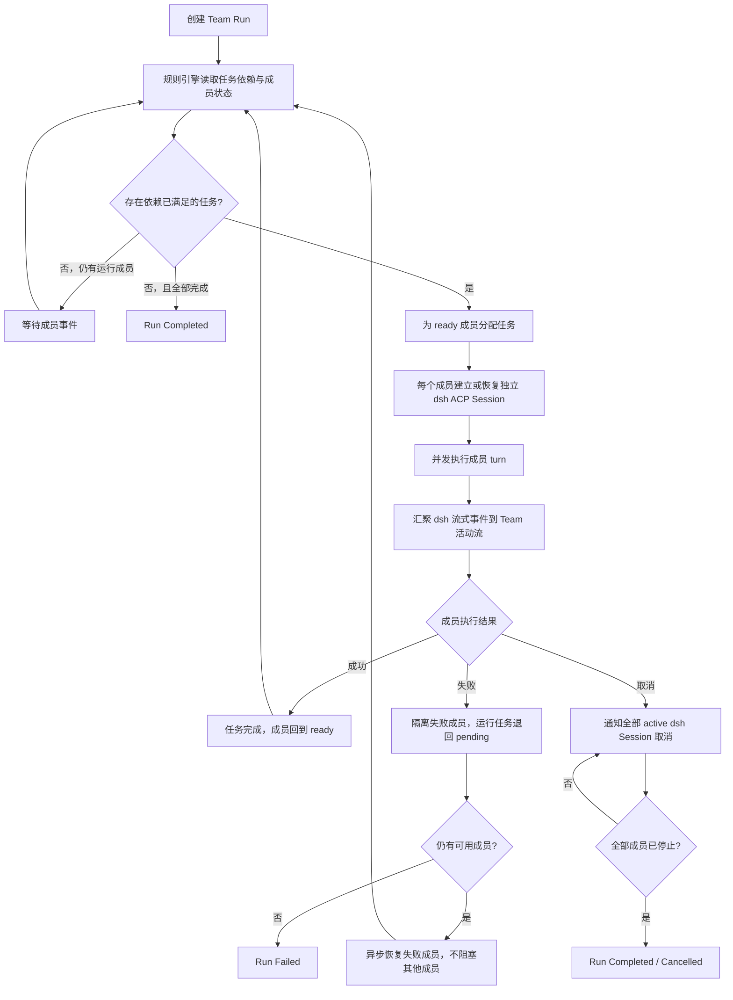
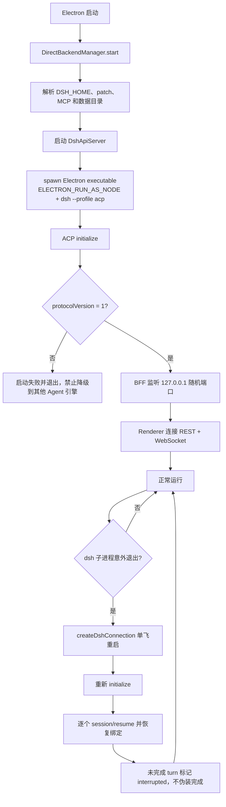

# uDeepseekRSI 总体技术架构与流程

> 基线日期：2026-09-06  
> 架构目标：保留 AionUi 的 Electron/React 产品壳；Agent 推理、工具循环、会话执行和模型调用完全由 `deepseek-harness`（以下简称 dsh）提供。产品代码不 fork、不 vendor、不修改 dsh 源码。

## 1. 架构原则

1. **唯一 Agent 引擎**：所有单 Agent 执行均进入 dsh；产品侧不得新增第二套 Agent loop，也不得回退到 aioncore、Claude/Codex CLI 或自研模型循环。
2. **唯一协议边界**：`packages/dsh-bridge` 是产品代码中唯一允许感知 ACP 方法、事件字段、stop reason 和 dsh 进程生命周期的模块。
3. **稳定产品门面**：Renderer 继续依赖 `packages/desktop/src/common/adapter/ipcBridge.ts` 暴露的领域 API；迁移和兼容逻辑集中在 BFF，不把 dsh 协议扩散到 UI。
4. **进程隔离**：Renderer 不使用 Node.js API；Electron Main 负责本机能力和 BFF 生命周期；dsh 作为 `ELECTRON_RUN_AS_NODE` 子进程运行，通过 stdio ACP v1 通信。
5. **dsh 可升级**：dsh 只通过精确锁定的 npm 包引入；定制通过 Profile、Bundle 和 `cordis.patch.yml` 完成，升级差异由 bridge 契约测试吸收。
6. **Team 不等于第二套 Agent 引擎**：`dsh-team` 只负责任务、成员、邮箱和恢复等确定性编排；每个成员的实际 Agent 执行仍由独立 dsh ACP Session 完成。

## 2. 总体技术架构图

### 边界说明

| 边界                | 协议/职责                                                             | 禁止事项                                      |
| ------------------- | --------------------------------------------------------------------- | --------------------------------------------- |
| Renderer → BFF      | `ipcBridge` 门面内部使用 REST；实时事件使用 WebSocket                 | Renderer 直接 import Main、Node.js 或 ACP API |
| Electron Main → BFF | `DirectBackendManager` 在 Main 内启动并管理 `DshApiServer`            | 恢复旧 aioncore Agent 业务路径                |
| BFF → dsh           | stdio 上的 ACP v1；初始化、建会话、提示、取消、权限、配置、恢复和关闭 | 其他模块直接依赖 ACP；修改 dsh 源码           |
| dsh → 模型/工具     | dsh Cordis 插件和 Profile 配置                                        | 产品侧实现并行 Agent loop                     |
| Team → Agent        | 每个成员映射到一个或多个 dsh ACP Session                              | Team 状态机直接调用模型 API                   |

## 3. Agent 引擎内部构成

产品当前通过 `.aionui/dsh-aionui.patch.yml` 配置模型 Provider、ACP 默认模型、Web Search、Web Fetch、`workspace-write` 沙箱和 `ask` 审批策略。正式打包时由 `DSH_PATCH_PATH` 或 `resources/dsh/dsh-aionui.patch.yml` 注入，避免修改 npm 依赖源码。

## 4. 单 Agent 消息主流程图

### 中断分支

## 5. Team / 多 Agent 编排流程图

`dsh-team` 只维护 `runStatus`、成员状态、任务依赖和失败恢复等领域状态。它通过 `dsh-bridge` 发起成员会话，不拥有推理、上下文压缩、工具调度或模型 Provider。

## 6. 启动与异常恢复流程图

恢复语义必须满足：已向用户确认完成的 prompt/assistant 最终消息不得静默消失；允许丢失尚未确认完成的流式尾部，但恢复后必须明确标记为 interrupted；重复事件必须通过 turn/message 幂等键去重。

## 7. 部署与数据所有权

| 数据/能力                                 | 所有者                       | 说明                               |
| ----------------------------------------- | ---------------------------- | ---------------------------------- |
| 对话列表、产品消息、项目绑定、UI 设置     | `dsh-bridge` 产品状态存储    | 面向 AionUi 领域 API 和历史展示    |
| Agent 上下文与可恢复 Session              | dsh Session Persistence      | 仅通过 ACP `new/resume/close` 操作 |
| Team、成员、任务、邮箱、Run 状态          | `dsh-team` 产品领域存储      | 不写入 dsh 内部数据库              |
| 模型调用、推理、工具循环、上下文压缩      | deepseek-harness             | 唯一 Agent 引擎责任域              |
| 文件、Office 预览、系统 Shell、窗口与更新 | Electron Main / BFF 本机服务 | 产品能力，不构成第二套 Agent 引擎  |
| 密钥与运行配置                            | 环境变量 + dsh patch/Profile | 不写入 Renderer，不修改 dsh 包源码 |

## 8. 当前实现状态

| 模块                                                                       | 当前状态                                             |
| -------------------------------------------------------------------------- | ---------------------------------------------------- |
| `packages/dsh-bridge` ACP 进程、会话、prompt、cancel、权限、配置、事件映射 | 已有实现                                             |
| `DshApiServer` REST/WS BFF、基础产品状态、项目文件和 Office 预览           | 已有实现，仍在扩充领域覆盖与持久化强度               |
| Electron `DirectBackendManager` 直接启动 BFF 和 dsh                        | 已接线                                               |
| Renderer 稳定 `ipcBridge` 门面到新 BFF 的集中映射                          | 迁移中                                               |
| `packages/dsh-team` Team 状态机                                            | 原型已存在，完整 Team BFF/持久化/活动流尚未完成      |
| aioncore 剥离和旧数据迁移                                                  | 尚未完全收尾；目标架构中不再承担 Agent 引擎职责      |
| dsh Provider Team 集成                                                     | Phase 0 的 S0-7 仍为 NO-GO；不得将其描述为已交付能力 |

## 9. 代码落点

| 组件                  | 路径                                                                                 |
| --------------------- | ------------------------------------------------------------------------------------ |
| 产品领域门面          | `packages/desktop/src/common/adapter/ipcBridge.ts`                                   |
| Electron BFF 生命周期 | `packages/desktop/src/process/backend/directBackendManager.ts`                       |
| REST/WS BFF           | `packages/dsh-bridge/src/DshApiServer.ts`                                            |
| dsh 领域桥            | `packages/dsh-bridge/src/DshBridge.ts`                                               |
| ACP 子进程连接与恢复  | `packages/dsh-bridge/src/createDshConnection.ts`                                     |
| Team 状态机           | `packages/dsh-team/src/stateMachine.ts`                                              |
| dsh 产品配置          | `.aionui/dsh-aionui.patch.yml`（开发）/ `resources/dsh/dsh-aionui.patch.yml`（打包） |
